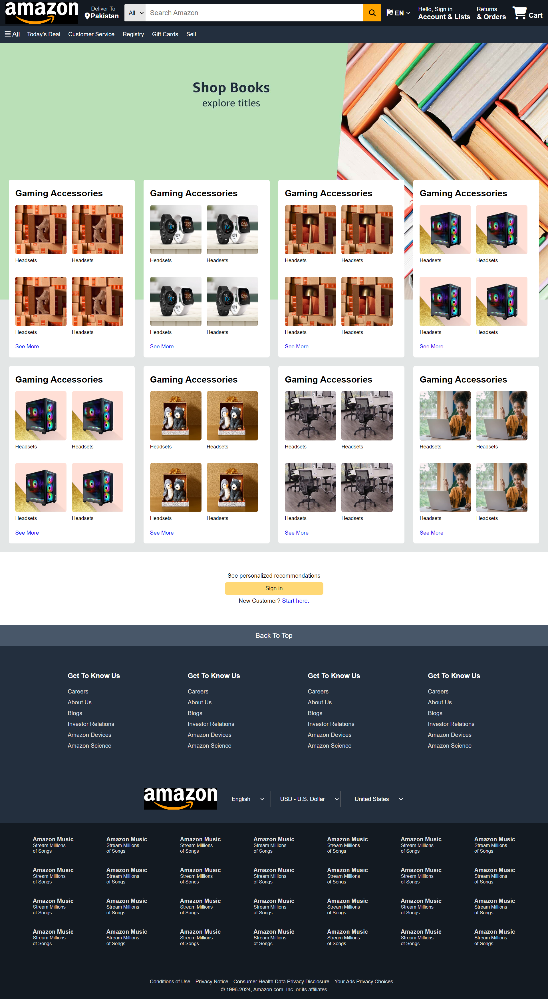

# Amazon Home Page Clone

Welcome to the Amazon Home Page Clone project! This project demonstrates the recreation of the Amazon website's home page using only HTML and CSS, without any JavaScript. The primary goal of this project is to showcase basic HTML and CSS skills.

## Table of Contents

- [Overview](#overview)
- [Features](#features)
- [Technologies Used](#technologies-used)
- [Purpose](#purpose)
- [Contact](#contact)

## Overview

This project is a clone of the Amazon home page, created to practice and improve my knowledge of HTML and CSS. The project replicates the layout and styling of the Amazon home page as closely as possible without using any JavaScript for functionality.

## Features

- Responsive design for different screen sizes
- HTML5 semantic elements for better structure and accessibility
- CSS3 styling for an attractive and functional design
- Flexbox and Grid layout techniques for positioning elements

## Technologies Used

- **HTML5**: For the structure and content of the web page
- **CSS3**: For the styling and layout of the web page

## Purpose

The purpose of this project is to practice and improve my knowledge of HTML and CSS by replicating the layout and styling of the Amazon home page as closely as possible without using any JavaScript for functionality.

---

Thank you for checking out my Amazon Home Page Clone project! I hope you find it useful for understanding basic HTML and CSS concepts.

### Contact

- **Name:** Muhammad Awais Arshad
- **GitHub:** [awaisarshad819](https://github.com/awaisarshad819)
- **Email:** [awaisarshad819@gmail.com](mailto:awaisarshad819@gmail.com)
- **LinkedIn:** [Muhammad Awais Arshad](https://www.linkedin.com/in/muhammadawais-arshad/)

Feel free to reach out if you have any questions or suggestions!

---

*Note: This project is for educational purposes only and is not affiliated with or endorsed by Amazon.*

